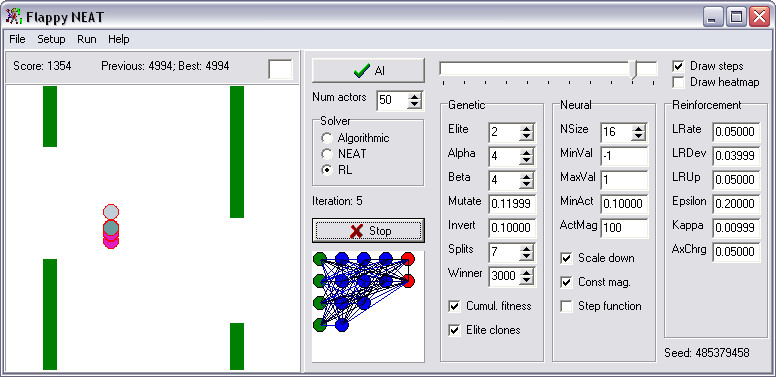

# 🐤 Flappy NEAT

**Flappy NEAT** is a chaotic little testbench where neural networks learn to play a Flappy Bird–style game using a mix of **genetic neuro-evolution** and **reinforcement learning**. It’s designed to let you:

- Compare **human**, **algorithmic**, **neuro-evolved**, and **RL-trained** performance
- Seamlessly switch from **evolution** to **RL fine-tuning** once a score threshold is hit
- Experiment with unique genetic operators and learning tricks you've probably never seen before

It’s a research toy, a performance benchmark, and a testbed for weird ideas—all in one.

---

## 🧠 Highlights

- 🚀 **Alpha-selection**: A novel genetic operator to drive better diversity
- 🔥 **Neuron heat dynamics**: RL weight updates are modulated by how “hot” neurons are
- 🧬 **Custom crossover/inversion/mutation logic**
- 🎩 **Interactive human mode** for score comparison
- 🤖 **Algorithmic solver mode** (perfect agent)
- 🧪 **Experimental PPO-inspired RL strategy**
- 🔀 **Hybrid GA → RL transition** based on fitness threshold
- 🛠️ **Live UI** with parameter tweaking
- 📚 **Help system** built into the UI with all information needed to understand every parameter
- 🔄 **Save/load for agents and populations**
- 🌍 **Neural network visualization and weight matrix viewer**
- 🕛 **Scenario replay support for post-mortem analysis**

---

## 🛠️ Running the Project

### A precompiled `.exe` is provided with each release - you can run it directly in windows or WINE.

This program was built using **Delphi 7**, which means:

> ⚠️ You will need a **Windows XP environment** with **Delphi 7** installed to compile and run this project.

We recommend spinning up a virtual machine for this purpose. Nostalgia points are included for free.

---

## 🧪 Sample Use Case

Train a population to solve the level using evolution, then transition into RL for fine-tuning behavior. Compare its score to your own flapping skills, or the perfect algorithmic solver. Discover if your `AlphaSort` operator beats standard crossover methods. Watch neuron "heat maps" influence updates. Or just... create a mutant bird that flaps with pure chaos.

Hint: Try to use test INI files provided in the repo.

### (C) Dmitry 'MatrixS_Master' Solovyev, 2025

### License: GPL v3
